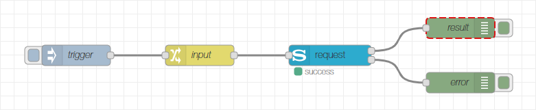

# node-red-contrib-sony-audio-control
A collection of Node-RED nodes to control Sony audio devices via the Sony Audio Control API.

With these nodes you can connect to your Sony audio devices and send control commands (like powering on/off, change volume etc.), retrieve information (like the current volume, the current value of a sound setting etc.) or get notified of certain events (like a change of the power state, a change of the mute state etc.).

If you would like to propose a new feature or any kind of improvement or if you want to report a bug, don't hesitate to create an issue in the [issue tracker](https://github.com/jensrossbach/node-red-contrib-sony-audio-control/issues) of the repository on GitHub.

- [Documentation](#documentation)
  - [Request Node](#request-node)
    - [Input](#input)
    - [Outputs](#outputs)
  - [Event Node](#event-node)
     - [Configuration](#configuration-1)
     - [Output](#output)
  - [Control Node](#control-node)
    - [Configuration](#configuration-2)
    - [Input](#input-1)
    - [Outputs](#outputs-1)
  - [Filter Node](#filter-node)
    - [Configuration](#configuration-3)
    - [Input](#input-2)
    - [Outputs](#outputs-2)
- [Sony Trademark](#sony-trademark)
- [License](#license)

## Documentation
The node collection consists of four flow nodes and one configuration node. The configuration node stores the network address of your Sony audio device. You have to specify a host name (or IP address) and the port (by default, port 10000 is used).

### Request Node
The request node of the Node-RED Sony Audio Control node collection is the interface to the request/response API of Sony audio devices. It provides the full power of the Sony Audio Control API but requires some knowledge of the API when used stand-alone. Therefore it is recommended to combine a request node with a control node and/or a filter node. If you still want to use the node stand-alone (because maybe the required functionality is not available through the control node), you should read the specification of the [Sony Audio Control API](https://developer.sony.com/develop/audio-control-api/hardware-overview/api-overview).

#### Configuration
In the configuration page of the node, you can choose a name (if no name is provided, the default name will be "request") and select the configuration node dedicated to your Sony audio device.

#### Input
The input message of the request node must contain the three properties `msg.service`, `msg.method` and `msg.version`. The service property refers to the API service which provides the desired method. The method property contains the request method of the API and the version property refers to the API version of the method. Additionally the `msg.payload` must contain the parameters of the request if applicable. It has to be an object containing the parameters as properties. There is no need to encapsulate the payload into an array, this is automatically done by the request node. For methods that do not have parameters, the `msg.payload` must be set to `null`.

#### Outputs
The request node provides two outputs. The first output contains the result of the request in the `msg.payload`. A message is only sent on success. The encapsulating array as coming from the device is already removed, so the payload is either an object with the result properties or an array in case a list of properties is returned. For the case that the request has no response parameters (empty result), the payload will be `null`. The second output sends a message with the error details in case the request failed. The information is provided in the `msg.payload` which is an object with the properties `error` containing the error code and `description` containing a human readable description of the error.

The error codes are defined by the Sony Audio Control API, however some node related error might also occur:

|Error Code|Description                                |
|----------|-------------------------------------------|
|32568     |Invalid node input                         |
|32569     |Invalid command (to the control node)      |
|32570     |Error in communication with the API service|

Both outputs additionally contain the properties `msg.service`, `msg.method` and `msg.version` corresponding to the request.

### Event Node
The event node of the Node-RED Sony Audio Control node collection is the interface to the notification API of Sony audio devices. It allows to subscribe for certain notification events of the different API services and provides the details of the notification on its output. The information provided at the output is in the format sent by the device and requires some knowledge of the API when used stand-alone. Therefore it is recommended to combine an event node with a filter node. If you still want to use the node stand-alone (because maybe the required filtering is not available through the filter node), you should read the specification of the [Sony Audio Control API](https://developer.sony.com/develop/audio-control-api/hardware-overview/api-overview).

#### Configuration
In the configuration page of the node, you can choose a name (if no name is provided, the default name will be "event: _service_") and select the configuration node dedicated to your Sony audio device. Besides of this, you have to choose the service which provides the notification events you want to subscribe for. Depending on the selected service, a set of checkboxes appears where you can select the notification events to subscribe. If you want to get notified for events from multiple services, you have to create a dedicated event node for each service of interest.

#### Output
On the output a message is sent each time a subscribed notification event is fired by the device. It contains the parameters of the notification in the `msg.payload`. The encapsulating array as coming from the device is already removed, so the payload is either an object with the event properties or an array in case a list of properties is sent. For the case that the notification has no parameters (empty parameter set), the payload will be `null`. The message additionally contains the properties `msg.service`, `msg.method` and `msg.version` corresponding to the notification.

### Control Node
The control node of the Node-RED Sony Audio Control node collection supports the creation of requests to control a Sony audio device. The node itself is not able to communicate with the device and therefore not useable stand-alone. Rather its output must be connected to a request node in order to send requests to the device.

#### Configuration
In the configuration page of the node, you can choose the name of the node (if no name is provided, the default name will be "control: _command_"). Additionally the command can be chosen which will be executed unless it is overwritten by the input message. Depending on the selected command, different settings may be configured. Also here applies that parameters from the input message might (partly) overwrite the chosen settings.

The following commands can be configured. The table shows also how they map to the commands that can be specified via the input message.

|Configuration         |Command         |Description                                                                  |
|----------------------|----------------|-----------------------------------------------------------------------------|
|Get Power Status      |getPowerStatus  |Retrieve current power status of the device                                  |
|Power ON              |powerOn         |Switch on power of the device                                                |
|Power OFF             |powerOff        |Switch off power of the device (device is not reachable via network anymore!)|
|Standby               |standby         |Switch the device into standby mode                                          |
|Get Source            |getSource       |Retrieve the currently active audio source on the device                     |
|Set Source            |setSource       |Set the currently active audio source                                        |
|Get Volume Information|getVolumeInfo   |Retrieve information about current volume and mute state                     |
|Set Volume            |setVolume       |Set current volume                                                           |
|Mute                  |mute            |Mute the audio output                                                        |
|Unmute                |unmute          |Unmute the audio output                                                      |
|Toggle Mute           |toggleMute      |Toggle between muted and unmuted audio output                                |
|Get Sound Settings    |getSoundSettings|Retrieve current sound settings on the device                                |
|Set Sound Settings    |setSoundSettings|Set sound settings on the device                                             |

Below table shows the mapping from configuration settings to settings which can be provided via the input message. See next chapter for more information about overwriting settings via the input message.

|Configuration                     |Setting       |
|----------------------------------|--------------|
|Source                            |type, source  |
|Port                              |port          |
|Volume                            |volume        |
|Relative Volume                   |relativeVolume|
|List of Sound Settings1|soundSettings |
|Target                            |target        |
|Zone                              |zone          |

1 The list of sound settings is a list where you can add new rows each representing a sound setting. You can choose the setting from the dropdown box and then depending on the selected setting, either turn the setting on or off, or select the setting's value from a second dropdown box.

#### Input
The input of the control node is used to trigger an action on one side and can be utilized to overwrite the command and its settings (or a part of them) from the configurations page on the other side.

The command of the request can be overwritten by specifying it in the `msg.command` argument of the input message. Command settings (for instance the volume of a `setVolume` command) can be overwritten by adding them to the `msg.payload` argument of the input message. You can overwrite all command settings or only some of them. All settings which are not specified in the input message will be taken from the node configuration. The `msg.payload` parameter must be an object with one property for each command setting.

The following properties are defined:

|Property      |Applicable to Command|Type        |Description                                                                                |
|--------------|----------------     |------------|-------------------------------------------------------------------------------------------|
|type1|setSource          |String      |The type of the audio source to be activated                                               |
|source1|setSource        |String      |The audio source to be activated                                                           |
|port1|setSource          |Number [1-9]|The port for an HDMI input                                                                 |
|volume        |setVolume            |Number      |The volume to set, can either be an absolute volume (>= 0) or a relative volume step (!= 0)|
|relativeVolume|setVolume            |Boolean     |True if the provided volume is a relative volume step, false otherwise                     |
|soundSettings2|setSoundSettings|Array |The sound settings to be activated                                                         |
|target        |getSoundSettings     |String      |The sound setting to retrieve                                                              |
|zone3|setSource, getSource, setVolume, getVolumeInfo, mute, unmute, toggleMute|Number [0-9]|The ouput zone of the device          |

1 The audio source can be specified via the properties `type`, `source` and `port`. The latter is only needed for HDMI sources. The following combinations are possible:

|type    |source  |port |
|--------|--------|-----|
|extInput|tv      |     |
|extInput|sat-catv|     |
|extInput|hdmi    |[1-9]|
|extInput|video   |     |
|extInput|sacd-cd |     |
|extInput|bd-dvd  |     |
|extInput|line    |     |
|extInput|btAudio |     |
|extInput|game    |     |
|extInput|source  |     |
|storage |usb1    |     |
|dlna    |music   |     |
|radio   |fm      |     |

2 The sound settings can be specified via property `soundSettings` which is an array of objects each consisting of the properties `target` and `value`. The following combinations are possible:

|target      |value     |
|------------|----------|
|soundField  |off       |
|soundField  |standard  |
|soundField  |clearAudio|
|soundField  |music     |
|soundField  |movie     |
|soundField  |sports    |
|soundField  |game      |
|clearAudio  |off       |
|clearAudio  |on        |
|nightMode   |off       |
|nightMode   |on        |
|footballMode|off       |
|footballMode|on        |
|voice       |type1     |
|voice       |type2     |
|voice       |type3     |

3 Setting `zone` to 0 means that all output zones are affected.

#### Outputs
The output contains the `msg.service`, `msg.method`, `msg.version` and `msg.payload` properties corresponding to the input of the request node.

### Filter Node
The event node of the Node-RED Sony Audio Control node collection is used to filter the result from control requests or the parameters of notification events according to configured filter criteria. It is therefore utilized in combination with a request and/or event node.

#### Configuration
In the configuration page of the node, you can choose the name of the node (if no name is provided, the default name will be "filter: _list of filters_"). Additionally there is a list of filters which can be extended or reduced as needed. Use the button under the list to add new filters, use the 'x' button on the right side of each filter to delete it or drag the filter rows to reorder the list. Each filter gets a dedicated output assigned which is indicated on the right side of the filter. Via the dropdown box, you can select the filter, some filters have further selection possibilities.

The powered and standby filters provide an additional checkbox "only if true". If checked, a message is only sent if the `msg.payload` is true. This is most useful when using in combination with an event node and you only want to be triggered if the device actually switched to powered or standby state (without evaluating the result).

The sound settings filter provides an additional dropdown box to select the setting you want to filter for.

#### Input
The filter node expects the output messages from a request node or an event node as input. It will then process the messages according to the selected filters and produce output messages accordingly.

#### Outputs
The filter node has a variable number of outputs which is determined by the number of configured filters. Each filter gets a dedicated output assigned. When there is an input message arriving and a filter matches the input (i.e. it can handle the method of the input message), it will process the message and send a filtered message on its dedicated output. If multiple filters match the input, there will be multiple output messages sent. The filtered data in contained in the `msg.payload` of the output messages.

The following table lists the payload formats for the different filters:

|Filter                   |Format         |Description                                                       |
|-------------------------|---------------|------------------------------------------------------------------|
|Powered                  |Boolean        |True if device is powered on, false if in standby or shutting down|
|Standby                  |Boolean        |True if device is in standby, false if powered on or shutting down|
|Source1       |Object         |The current audio source on the device                            |
|Absolute Volume          |Number         |The current absolute volume                                       |
|Relative Volume          |Number         |The current relative volume                                       |
|Muted                    |Boolean        |True if the audio output is muted, false otherwise                |
|Sound Setting2|String, Boolean|The current value of the selected sound setting                   |

1 The audio source is provided via the properties `type`, `source` and `port`. The latter is only present for HDMI sources. The following combinations are possible:

|type    |source  |port |
|--------|--------|-----|
|extInput|tv      |     |
|extInput|sat-catv|     |
|extInput|hdmi    |[1-9]|
|extInput|video   |     |
|extInput|sacd-cd |     |
|extInput|bd-dvd  |     |
|extInput|line    |     |
|extInput|btAudio |     |
|extInput|game    |     |
|extInput|source  |     |
|storage |usb1    |     |
|dlna    |music   |     |
|radio   |fm      |     |

2 Depending on the selected sound setting, the output format is like described in below table:

|Sound Setting|Format |Description                                         |
|-------------|-------|----------------------------------------------------|
|Sound Field  |String |The name of the Sound Field setting                 |
|Clear Audio +|Boolean|True if the Clear Audio + is active, false otherwise|
|Night Mode   |Boolean|True if the Night Mode is active, false otherwise   |
|Football Mode|Boolean|True if the Football Mode is active, false otherwise|
|Voice        |String |The name of the Voice setting                       |

## Sony Trademark
The trademark "SONY" and any other product names, service names or logos of SONY used, quoted and/or referenced in this Web Site are trademarks or registered trademarks of Sony Corporation or any of its affiliates.

## License
Copyright (c) 2019 Jens-Uwe Rossbach

This code is licensed under the MIT License.

Permission is hereby granted, free of charge, to any person obtaining a copy
of this software and associated documentation files (the "Software"), to deal
in the Software without restriction, including without limitation the rights
to use, copy, modify, merge, publish, distribute, sublicense, and/or sell
copies of the Software, and to permit persons to whom the Software is
furnished to do so, subject to the following conditions:

The above copyright notice and this permission notice shall be included in all
copies or substantial portions of the Software.

THE SOFTWARE IS PROVIDED "AS IS", WITHOUT WARRANTY OF ANY KIND, EXPRESS OR
IMPLIED, INCLUDING BUT NOT LIMITED TO THE WARRANTIES OF MERCHANTABILITY,
FITNESS FOR A PARTICULAR PURPOSE AND NONINFRINGEMENT. IN NO EVENT SHALL THE
AUTHORS OR COPYRIGHT HOLDERS BE LIABLE FOR ANY CLAIM, DAMAGES OR OTHER
LIABILITY, WHETHER IN AN ACTION OF CONTRACT, TORT OR OTHERWISE, ARISING FROM,
OUT OF OR IN CONNECTION WITH THE SOFTWARE OR THE USE OR OTHER DEALINGS IN THE
SOFTWARE.