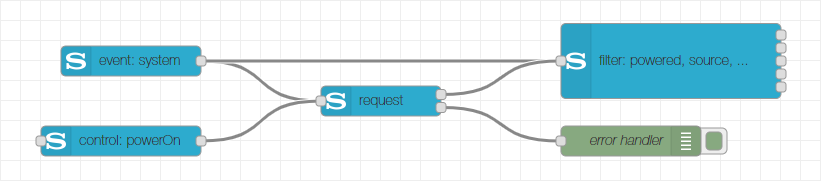

# Documentation
This is the online documentation of the Node-RED Sony Audio Control node collection. The nodes provide capabilities to control Sony audio devices via the Sony Audio Control API.

The node collection consists of four nodes and a configuration node. The configuration node stores the network address of your Sony audio device. You have to specify a host name (or IP address) and optionally the port (by default, port 10000 is used).

## Request Node
The request node is the interface to the request/response API of Sony audio devices. It provides the full power of the Sony Audio Control API but requires some knowledge of the API when used stand-alone. [Read more...](sony-audio-request.md)

## Event Node
The event node is the interface to the notification API of Sony audio devices. It allows to subscribe for certain notification events of the different API services and provides the details of the notification on its output. The information provided at the output is in the format sent by the device and requires some knowledge of the API when used stand-alone. [Read more...](sony-audio-event.md)

## Control Node
The control node supports the creation of requests to control a Sony audio device. The node itself is not able to communicate with the device and therefore not useable stand-alone. Rather its output must be connected to a request node in order to send requests to the device. [Read more...](sony-audio-control.md)

## Filter Node
The event node is used to filter the result from control requests or the parameters of notification events according to configured filter criteria. It is therefore utilized in combination with a request and/or event node. [Read more...](sony-audio-filter.md)

## License
Copyright (c) 2019 Jens-Uwe Rossbach

This code is licensed under the MIT License.

Permission is hereby granted, free of charge, to any person obtaining a copy
of this software and associated documentation files (the "Software"), to deal
in the Software without restriction, including without limitation the rights
to use, copy, modify, merge, publish, distribute, sublicense, and/or sell
copies of the Software, and to permit persons to whom the Software is
furnished to do so, subject to the following conditions:

The above copyright notice and this permission notice shall be included in all
copies or substantial portions of the Software.

THE SOFTWARE IS PROVIDED "AS IS", WITHOUT WARRANTY OF ANY KIND, EXPRESS OR
IMPLIED, INCLUDING BUT NOT LIMITED TO THE WARRANTIES OF MERCHANTABILITY,
FITNESS FOR A PARTICULAR PURPOSE AND NONINFRINGEMENT. IN NO EVENT SHALL THE
AUTHORS OR COPYRIGHT HOLDERS BE LIABLE FOR ANY CLAIM, DAMAGES OR OTHER
LIABILITY, WHETHER IN AN ACTION OF CONTRACT, TORT OR OTHERWISE, ARISING FROM,
OUT OF OR IN CONNECTION WITH THE SOFTWARE OR THE USE OR OTHER DEALINGS IN THE
SOFTWARE.