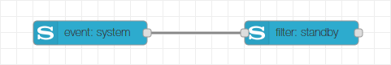

# Event Node
The event node of the Node-RED Sony Audio Control node collection is the interface to the notification API of Sony audio devices. It allows to subscribe for certain notification events of the different API services and provides the details of the notification on its output. The information provided at the output is in the format sent by the device and requires some knowledge of the API when used stand-alone. Therefore it is recommended to combine an event node with a filter node. If you still want to use the node stand-alone (because maybe the required filtering is not available through the filter node), you should read the specification of the [Sony Audio Control API](https://developer.sony.com/develop/audio-control-api/hardware-overview/api-overview).

## Configuration
In the configuration page of the node, you can choose a name (if no name is provided, the default name will be "event: _service_") and select the configuration node dedicated to your Sony audio device. Besides of this, you have to choose the service which provides the notification events you want to subscribe for. Depending on the selected service, a set of checkboxes appears where you can select the notification events to subscribe. If you want to get notified for events from multiple services, you have to create a dedicated event node for each service of interest.

## Output
On the output a message is sent each time a subscribed notification event is fired by the device. It contains the parameters of the notification in the `msg.payload`. The encapsulating array as coming from the device is already removed, so the payload is either an object with the event properties or an array in case a list of properties is sent. For the case that the notification has no parameters (empty parameter set), the payload will be `null`. The message additionally contains the properties `msg.service`, `msg.method` and `msg.version` corresponding to the notification.

## License
Copyright (c) 2019 Jens-Uwe Rossbach

This code is licensed under the MIT License.

Permission is hereby granted, free of charge, to any person obtaining a copy
of this software and associated documentation files (the "Software"), to deal
in the Software without restriction, including without limitation the rights
to use, copy, modify, merge, publish, distribute, sublicense, and/or sell
copies of the Software, and to permit persons to whom the Software is
furnished to do so, subject to the following conditions:

The above copyright notice and this permission notice shall be included in all
copies or substantial portions of the Software.

THE SOFTWARE IS PROVIDED "AS IS", WITHOUT WARRANTY OF ANY KIND, EXPRESS OR
IMPLIED, INCLUDING BUT NOT LIMITED TO THE WARRANTIES OF MERCHANTABILITY,
FITNESS FOR A PARTICULAR PURPOSE AND NONINFRINGEMENT. IN NO EVENT SHALL THE
AUTHORS OR COPYRIGHT HOLDERS BE LIABLE FOR ANY CLAIM, DAMAGES OR OTHER
LIABILITY, WHETHER IN AN ACTION OF CONTRACT, TORT OR OTHERWISE, ARISING FROM,
OUT OF OR IN CONNECTION WITH THE SOFTWARE OR THE USE OR OTHER DEALINGS IN THE
SOFTWARE.