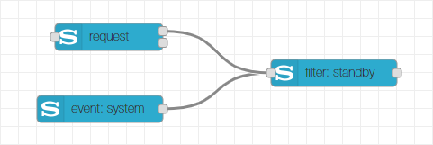

# Filter Node
The event node of the Node-RED Sony Audio Control node collection is used to filter the result from control requests or the parameters of notification events according to configured filter criteria. It is therefore utilized in combination with a request and/or event node.

## Configuration
In the configuration page of the node, you can choose the name of the node (if no name is provided, the default name will be "filter: _list of filters_"). Additionally there is a list of filters which can be extended or reduced as needed. Use the button under the list to add new filters, use the 'x' button on the right side of each filter to delete it or drag the filter rows to reorder the list. Each filter gets a dedicated output assigned which is indicated on the right side of the filter. Via the dropdown box, you can select the filter, some filters have further selection possibilities.

## Input
The filter node expects the output messages from a request node or an event node as input. It will then process the messages according to the selected filters and produce output messages accordingly.

## Outputs
The filter node has a variable number of outputs which is determined by the number of configured filters. Each filter gets a dedicated output assigned. When there is an input message arriving and a filter matches the input (i.e. it can handle the method of the input message), it will process the message and send a filtered message on its dedicated output. If multiple filters match the input, there will be multiple output messages sent. The filtered data in contained in the `msg.payload` of the output messages.

The following table lists the payload formats for the different filters:

|Filter         |Format         |Description                                            |
|---------------|---------------|-------------------------------------------------------|
|Powered        |Boolean        |True if device is powered on, false otherwise          |
|Standby        |Boolean        |True if device is in standby, false otherwise          |
|Source         |Object         |The current source on the device, see below for details|
|Absolute Volume|Number         |The current absolute volume                            |
|Relative Volume|Number         |The current relative volume                            |
|Muted          |Boolean        |True if the audio output is muted, false otherwise     |
|Sound Setting  |String, Boolean|The current sound setting, see below for details       |

### Source
The source is provided via the properties `type`, `source` and `port`. The latter is only present for HDMI sources. The following combinations are possible:

|type    |source  |port    |
|--------|--------|--------|
|extInput|tv      |        |
|extInput|sat-catv|        |
|extInput|hdmi    |[1 .. 9]|
|extInput|video   |        |
|extInput|sacd-cd |        |
|extInput|bd-dvd  |        |
|extInput|line    |        |
|extInput|btAudio |        |
|extInput|game    |        |
|extInput|source  |        |
|storage |usb1    |        |
|dlna    |music   |        |
|radio   |fm      |        |

### Sound Settings
Depending on the selected sound setting, the output format is like described in below table:

|Sound Setting|Format |Description                                         |
|-------------|-------|----------------------------------------------------|
|Sound Field  |String |The name of the Sound Field setting                 |
|Clear Audio +|Boolean|True if the Clear Audio + is active, false otherwise|
|Night Mode   |Boolean|True if the Night Mode is active, false otherwise   |
|Football Mode|Boolean|True if the Football Mode is active, false otherwise|
|Voice        |String |The name of the Voice setting                       |

## License
Copyright (c) 2019 Jens-Uwe Rossbach

This code is licensed under the MIT License.

Permission is hereby granted, free of charge, to any person obtaining a copy
of this software and associated documentation files (the "Software"), to deal
in the Software without restriction, including without limitation the rights
to use, copy, modify, merge, publish, distribute, sublicense, and/or sell
copies of the Software, and to permit persons to whom the Software is
furnished to do so, subject to the following conditions:

The above copyright notice and this permission notice shall be included in all
copies or substantial portions of the Software.

THE SOFTWARE IS PROVIDED "AS IS", WITHOUT WARRANTY OF ANY KIND, EXPRESS OR
IMPLIED, INCLUDING BUT NOT LIMITED TO THE WARRANTIES OF MERCHANTABILITY,
FITNESS FOR A PARTICULAR PURPOSE AND NONINFRINGEMENT. IN NO EVENT SHALL THE
AUTHORS OR COPYRIGHT HOLDERS BE LIABLE FOR ANY CLAIM, DAMAGES OR OTHER
LIABILITY, WHETHER IN AN ACTION OF CONTRACT, TORT OR OTHERWISE, ARISING FROM,
OUT OF OR IN CONNECTION WITH THE SOFTWARE OR THE USE OR OTHER DEALINGS IN THE
SOFTWARE.