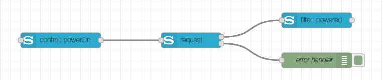

# Request Node
The request node of the Node-RED Sony Audio Control node collection is the interface to the request/response API of Sony audio devices. It provides the full power of the Sony Audio Control API but requires some knowledge of the API when used stand-alone. Therefore it is recommended to combine a request node with a control node and/or a filter node. If you still want to use the node stand-alone (because maybe the required functionality is not available through the control node), you should read the specification of the [Sony Audio Control API](https://developer.sony.com/develop/audio-control-api/hardware-overview/api-overview).

## Configuration
In the configuration page of the node, you can choose a name (if no name is provided, the default name will be "request") and select the configuration node dedicated to your Sony audio device.

## Input
The input message of the request node must contain the three properties `msg.service`, `msg.method` and `msg.version`. The service property refers to the API service which provides the desired method. The method property contains the request method of the API and the version property refers to the API version of the method. Additionally the `msg.payload` must contain the parameters of the request if applicable. It has to be an object containing the parameters as properties. There is no need to encapsulate the payload into an array, this is automatically done by the request node.

## Outputs
The request node provides two outputs. The first output contains the result of the request in the `msg.payload`. A message is only sent on success. The encapsulating array as coming from the device is already removed, so the payload is either an object with the result properties or an array in case a list of properties is returned. For the case that the request has no response parameters (empty result), the payload will be `null`. The second output sends a message with the error details in case the request failed. The information is provided in the `msg.payload` which is an object with the properties `error` containing the error code and `description` containing a human readable description of the error.

The error codes are defined by the Sony Audio Control API, however some node related error might also occur:
|Error Code|Description                                |
|----------|-------------------------------------------|
|32568     |Invalid node input                         |
|32569     |Invalid command (to the control node)      |
|32570     |Error in communication with the API service|

Both outputs additionally contain the properties `msg.service`, `msg.method` and `msg.version` corresponding to the request.

## License
Copyright (c) 2019 Jens-Uwe Rossbach

This code is licensed under the MIT License.

Permission is hereby granted, free of charge, to any person obtaining a copy
of this software and associated documentation files (the "Software"), to deal
in the Software without restriction, including without limitation the rights
to use, copy, modify, merge, publish, distribute, sublicense, and/or sell
copies of the Software, and to permit persons to whom the Software is
furnished to do so, subject to the following conditions:

The above copyright notice and this permission notice shall be included in all
copies or substantial portions of the Software.

THE SOFTWARE IS PROVIDED "AS IS", WITHOUT WARRANTY OF ANY KIND, EXPRESS OR
IMPLIED, INCLUDING BUT NOT LIMITED TO THE WARRANTIES OF MERCHANTABILITY,
FITNESS FOR A PARTICULAR PURPOSE AND NONINFRINGEMENT. IN NO EVENT SHALL THE
AUTHORS OR COPYRIGHT HOLDERS BE LIABLE FOR ANY CLAIM, DAMAGES OR OTHER
LIABILITY, WHETHER IN AN ACTION OF CONTRACT, TORT OR OTHERWISE, ARISING FROM,
OUT OF OR IN CONNECTION WITH THE SOFTWARE OR THE USE OR OTHER DEALINGS IN THE
SOFTWARE.